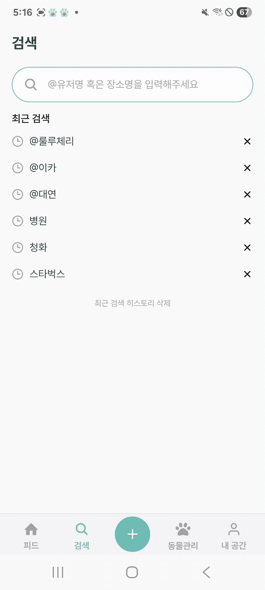
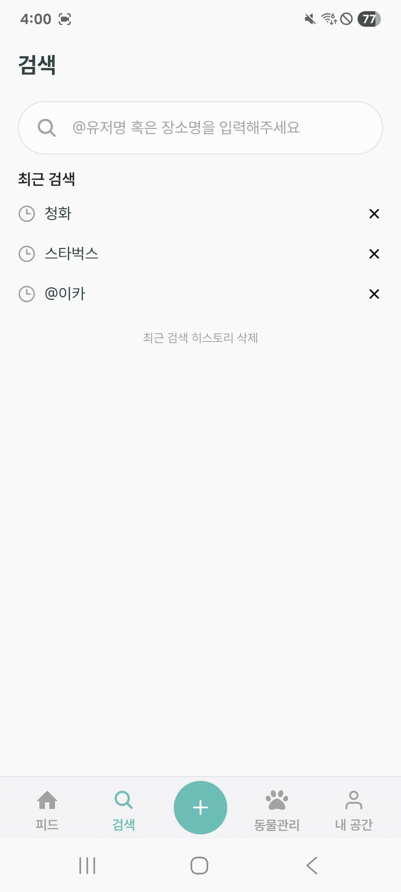
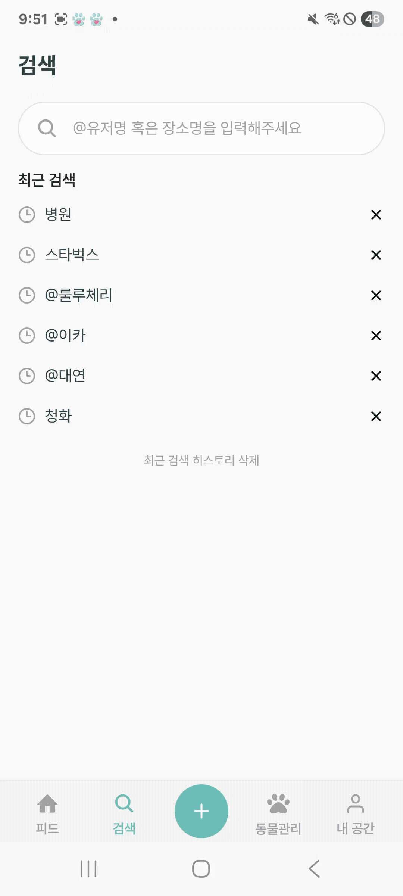
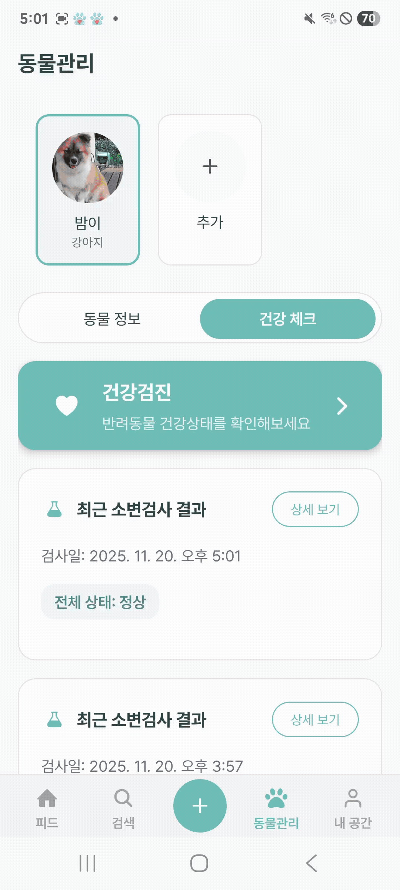

# 제리뽀

> 반려동물 종합 관리 플랫폼 서비스


# 📜 목차

- [서비스 개요](#서비스-개요)
- [주요 기능](#주요-기능)
- [기술 스택](#기술-스택)
- [아키텍처 구성](#아키텍처-구성)
- [폴더 구조](#-폴더-구조)
- [팀원 소개](#팀원-소개)

# 📝서비스 개요

### 반려동물 종합 관리 플랫폼 서비스

- 일기 형식으로 반려동물의 일상을 기록, 공유
- 반려동물 동반 가능 시설 조회 및 예약
- AI 기반 반려동물 건강 검사 및 검사 기록 관리

# ⚡주요 기능

### 1. 피드 작성 / 조회

- 일기 형식으로 반려동물의 일상을 기록
- 팔로워별 피드 목록 필터링
- 사진, 장소, 별점을 함께 업로드하여 자세하게 기록
  
  
  
  
### 2. 장소, 사용자 검색 및 예약

- @사용자, 장소 검색의 방법을 분리하여 반려동물 관련 정보를 손쉽게 탐색
- 장소 상세 페이지에서 예약기능 제공 -> SNS와 실제 서비스 이용의 연결
- 사용자 상세 페이지에서 팔로우 기능 제공

  <div classname = "flex">
  
  
  
  </div>

### 3. AI 기반 동물 건강 관리

- 요검사 키트를 촬영하면 CNN 모델이 색상 패턴을 분석하여 건강 지표를 자동 판별
- OpenCV 기반 색상 교정 및 영역 인식 기술을 적용하여 다양한 조명 환경에서도 정확한 판별 가능
- 색상 유사도 분석을 통해 10개 항목에 관한 검사 결과 제공
  
  <div classname = "flex">
    
    
  </div>

### 하이브리드 앱
- 카메라, GPS, 푸시 알림 등 네이티브 기기 기능을 활용하기 위해 네이티브 브릿지를 활용해 연동
- Android/Web 환경에서 FCM SDK를 연동하고 알림 메시지 전송 로직 구현


# 🛠기술 스택

### Frontend
- Language: TypeScript
- Framework: React Native, React
- UI/스타일링: TailwindCSS
- 상태 관리: Zustand

### Backend
- Language: Java 17
- Framework: Spring, Spring Boot 3.3.2, Spring Batch, Spring Scheduler
- Database: MySQL 8.0, MongoDB 8, Redis 7
- ORM: JPA
- 인증/보안: Spring Security
- Messaging & Search: Kafka 3.8.1, Elasticsearch 8.11.0
- AI : OpenCV, YOLOv8, DeltaE

### Infra
- Containerization: EC2, AWS S3, Docker, Docker Compose
- CI/CD: Jenkins

# 📐아키텍처 구성

### 시스템 아키텍처


# 📂 폴더 구조

```
JellyPaw/
│
├── frontend/                 # FE : React Native + React(Webview)
│   │
│   ├── jellypaw/             # React Native
│   │   └── ...
│   │
│   └── jellypaw-web/         # React + Vite + TypeScript 기반 Webview
│       └── ...
│
├── backend/                   # BE : MSA 구조
│   ├── user/                  # User (인증, 사용자, 반려동물, 팔로우, FCM)
│   ├── board/                 # 피드 CRU (게시글, 댓글, 좋아요, 장소)
│   ├── board-view/            # 피드 Read (조회 최적화)
│   └── reservation/           # 예약 서비스 (예약 관리, 예약 가능 시간)
│
├── ai/                      # AI : Python 기반 AI 분석
│   ├── cv_classic/
│   │   └── ...              # OpenCV 기반 분석 스크립트들
│   │
│   ├── yolo_model/          # YOLO 모델 기반 분석
│   │
│   ├── api_server.py        # FastAPI/Flask API 서버
│
└── README.md
```

# 👥팀원 소개

| 전윤지   | 김유성 | 송인범 | 안성수 | 이대연 | 한진경 |
| -------- | ------ | ------ | ------ | ------ | ------ |
| AI, 팀장 | BE | BE     | BE     | FE     | FE     |
